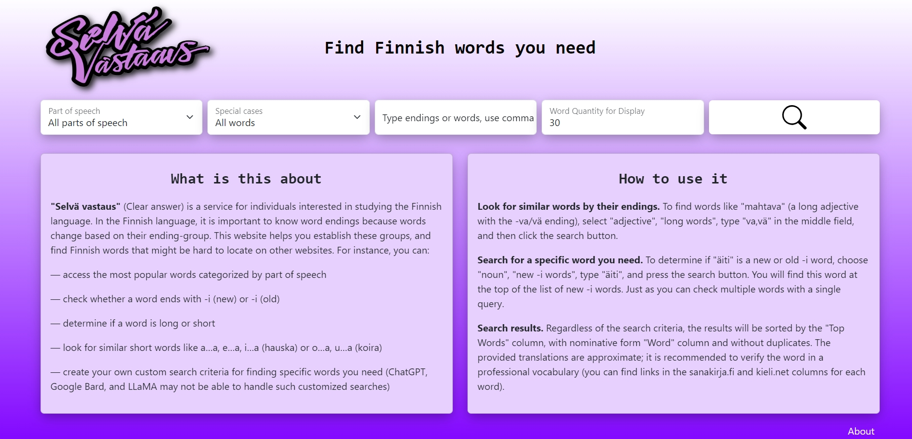
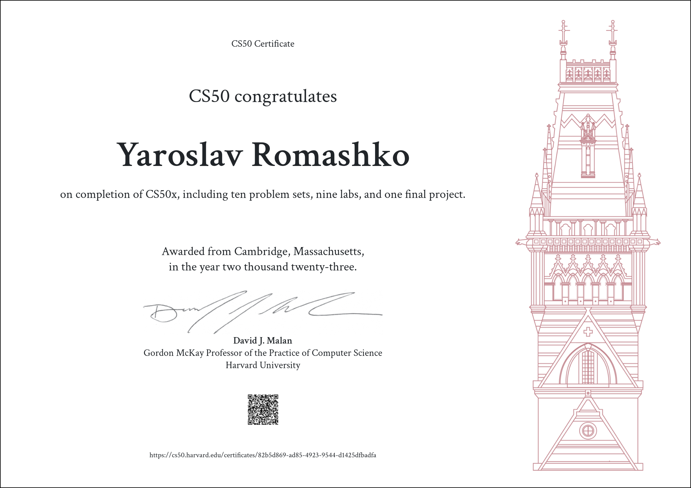
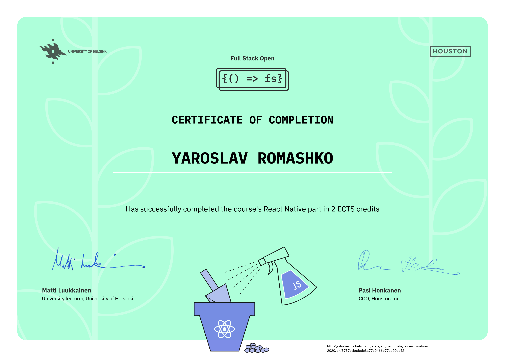
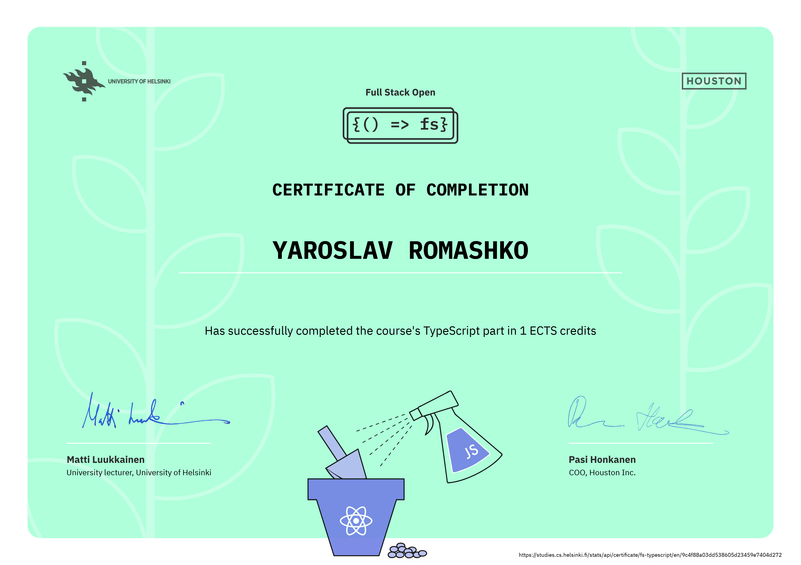

## :desktop_computer: my stats :

## :fire: my best project for now:

https://selvavastaus.onrender.com/

## 👨‍🎓 my certificates
### CS50x from Harward University (basics of IT: C, Python, SQL)

### Full Stack Open from Helsinki University:
### React, NodeJS, Express, MongoDB, Deploiment Web App (7 credits)

### TypeScript (2 credits)

### GraphQL (1 credit)

### Relational databases (1 credit)

### TypeScript (1 credit)

### CI/CD (1 credit)

### Containers (1 credit)

